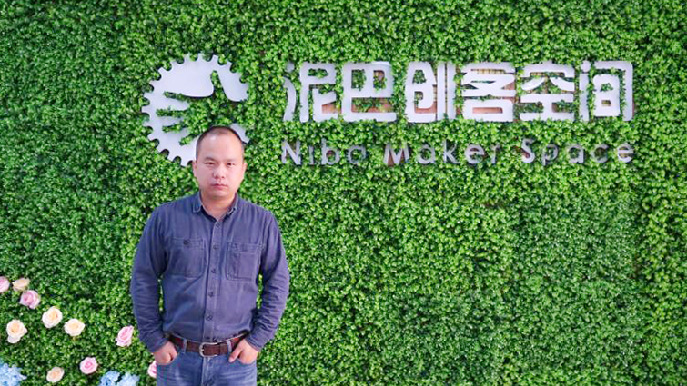

# 王愿杰
    泥巴创客教育创始人
    泥巴创客空间合伙人
    一个爱学习的程序员
    一个技术自由人。

03年毕业于兰州大学。13年离开中兴通讯，
目前负责泥巴创客空间的泥巴创客教育项目。
泥巴创客教育以“技术工作室”形式，承接各种互联网+、物联网、智能硬件项目的原型和样机开发。
边学习，边工作，以技术的先进性快速迭代，挤出利润空间。
截至目前，已成功完成多个web+和智能硬件项目，辅导竞赛若干。
最重要的是，在项目开发过程中，以练带学，带出了多个新鲜的团队。
欢迎爱学习、有激情的新人加入，输入新鲜血液，技术回馈社会。
