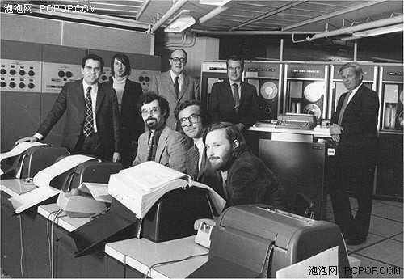
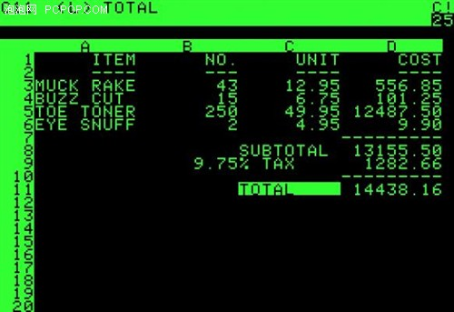
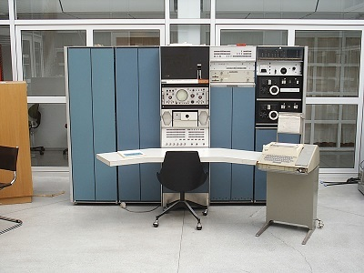
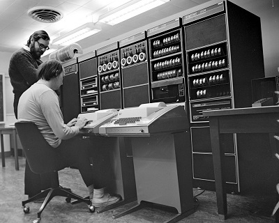
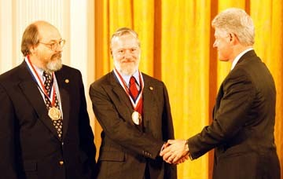
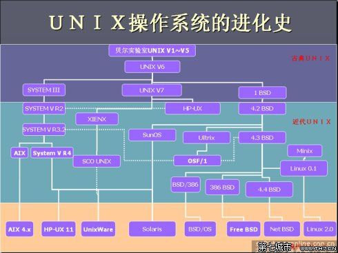
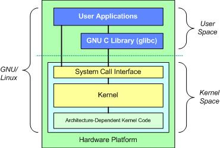

# 章节01：linux起源

由于早期的计算机并不像现在的个人计算机一样普遍，只有极少数人才有机会接触到，并且当时的计算机架构很难使用，操作接口麻烦。因此在1965年前后，由贝尔实验室（Bell）、麻省理工学院（MIT）及通用电气公司（GE）共同发起了Multics的项目，Multics（全称：MULTiplexed Information and Computing System）是一个全面的、通用的分时操作系统，Multics项目的目的是想让大型主机可以同时提供300台以上的终端机连接使用的目标。 
　　可是，到了1969年前后，项目进度落后，资金也短缺，在认为Multics项目不可能成功之后，贝尔实验室退出了该项目的研究工作。最终Multics项目还是成功地开发出了他们的系统，Multics系统虽然后来没有受到很大的重视，但是该项目培养出了很多优秀的人才，包括Ken Thompson、Dennis Ritchie、Joe Ossanna、Douglas McIlroy、Peter Neumann、Stan Dunten、Rudd Canaday等等。

图1. 参与Multics的科学家们

图2. 运行在multics上的软件

　　参与Multics项目的工程师们调回贝尔实验室后，面对实验室落后的仍以批处理工作的计算机环境，他们非常怀念Multics。其中一位工程师Ken Thompson，他因为想移植一套名为“太空旅游”的游戏，希望开发一个小的操作系统以供使用。1969年8月，万般无奈的Thompson在库房里发现了一个闲置的PDP-7，刚好此时处于休假期并且他的妻儿探亲去了，于是Thompson有了额外的一个月时间实施他的计划。经过4个星期的奋斗，以汇编语言写出了一组内核程序，还包括一些内核工具程序，以及一个小的文件系统。在操作系统、Shell程序、编辑器和汇编程序上，他各花了一周时间。 
　　由于当时Thompson从Multics项目中获得想法，将Multics庞大而复杂的系统进行简化，于是同实验室的朋友都戏称这个系统为Unics（该系统就是Unix的原型）。 
　　Thompson的这个文件系统有两个重要的概念，分别是：

所有的程序或系统装置都是文件。
不管构建编辑器还是附属文件，所写的程序只有一个目的，就是要有效地完成目标。
这些概念在后来对于Linux的开发有相当重要的影响。这也就是著名的KISS（keep it simple, stupid）原则，即“简单原则”——尽量用简单的方法解决问题，这是“Unix哲学”的根本原则。

图3. 最初运行Unix系统的DEC PDP-7
　　由于Thompson写的Unics实在太好用了，所以在贝尔实验室内部广为流传，并且多次经过改版。但是因为Unics是以汇编语言写的，高度依赖硬件，所以每次安装到不同的机器上都需要重新编写汇编语言。于是Thompson与Ritchie合作想将Unics改用更高级的程序语言来编写，从而提高可移植性。他们先选择了BCPL(简称B语言)，然后又尝试PASCAL,发现编译出来的内核性能都不是很好，因为这些语言都不太贴近硬件操作。于是，两人（主要是Dennis Ritchie）决定自己开发一套新的语言：这就是大名鼎鼎的 C 语言。

图4. Ken Thompson（坐着）和Dennis Ritchie在PDP-11前工作
　　1973年，Dennis Ritchie 用C 语言重写与编译Unics的内核，最后发行出Unix的正式版本。“重写”说起来简单，实际上并不是简单的汇编到C语言的翻译，这里边包含了很多的发明和创造。在此期间引入的“pipe”（管道）功能后来成为了Unix的一大优势，这种功能使得程序间输出结果的传递非常容易。管道的概念是贝尔实验室的Douglas McIlroy发明的，后被很多操作系统大量拷贝，其中包括Unix的所有变体、Linux、DOS和Windows。 
　　重写过的Unix很快就流行起来，此后便一直应用于生产领域。40多年过去了，虽然出现了很多的类Unix系统（例如Linux），但是他们都继承了Unix 中的基本思想，并且发扬光大。著名的类Unix系统包括Berkeley Unix、Minix、Linux、AIX、A/UX、HP-UX以及Solaris，苹果的Mac OS X则是基于Berkeley Software Distribution（简称BSD）Unix。

图5. 1998年被授予国家科技奖章（左起分别是Thompson、Ritchie和克林顿）
　　Unix是以C语言写成的，理论上是具有可移植性的，只要获得Unix的源码，并且针对大型主机的特性加以修改，就可能将Unix移植到另一台不同的主机上。 
　　1973年以后，Unix开始与学术界合作开发，其中最重要的是与加州大学伯克利分校（Berkeley）的合作。伯克利大学的Bill Joy在移植Unix的过程中加入了很多工具软件与编译程序，最终将它命名为Berkeley Software Distribution (BSD)。BSD是Unix很重要的一个分支。同时Bill Joy也是Sun这家公司的创办者。Sun公司即是以BSD开发的内核进行自己的商业Unix版本的开发的。（后来可以安装在x86硬件架构上面FreeBSD即是BSD改版而来！） 
　　由于Unix的高度可移植性与强大的性能，加上当时并没有版权的纠纷，所以让很多商业公司开始了Unix操作系统的开发。但每一家公司自己出品的Unix虽然在架构上大同小异，但是却仅能支持自身的硬件，所以，早些年的Unix只能与服务器（Server）或者大型工作站（Workstation）划上等号。直到1979年，AT&T推出了System V第七版Unix，才支持x86架构的个人计算机系统。后来因为AT&T出于商业考虑，想将Unix的版权收回去，因此在第七版System V中特别提到了“不可对学生提供源码”的严格限制。 
　　目前被称为纯种UNIX的指的就是System V和BSD这两套。

图5. 类Unix系统家谱
　　从Unix诞生之日起，各种信誓旦旦的预言就伴随着它，说Unix必将衰败，或者被其它操作系统挤出市场。可是在今天，它化身为Linux、BSD、Solaris、MacOS X以及好几个其它变种的Unix，却显得前所未有的强大。

## linux的出现

### Richard Stallman

### 角马

### GNU

### Richard Stallman

## linux家族

