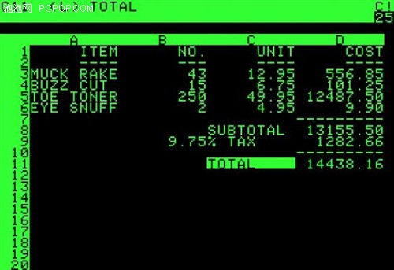
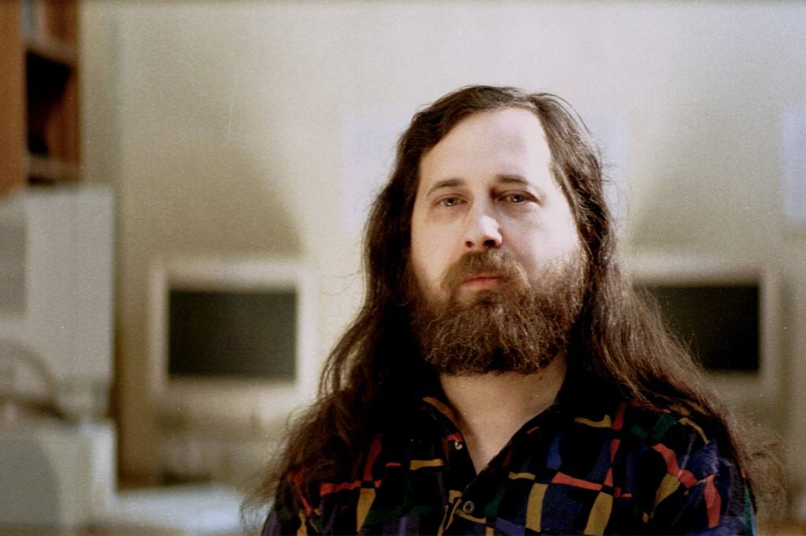
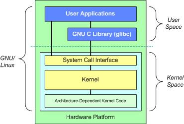

---
presentation:
  width: 1440
  height: 1024
---

<!-- slide -->
# 缘起
> damo wang

<!-- slide -->
## 1946

长30.48米，宽6米，高2.4米，占地170平方米，30个操作台，重30英吨，耗电量150千瓦，造价48万美元。包含了17,468根真空管（电子管）7,200根晶体二极管，1,500个中转，70,000个电阻器，10,000个电容器，1500个继电器，6000多个开关，每秒5000次加法或400次乘法。

<!-- slide -->
## 1969

<!-- slide -->
## Ken thompson

<!-- slide -->
## Dennis Ritchie

<!-- slide -->
## unix的混乱

<!-- slide -->
## 开源之父

<!-- slide -->

<!-- slide -->
## linus_torvalds

<!-- slide -->
## GNU/Linux

<!-- slide -->
## linux发行版

<!-- slide -->

<!-- slide -->
 

<!-- slide -->
# 未来